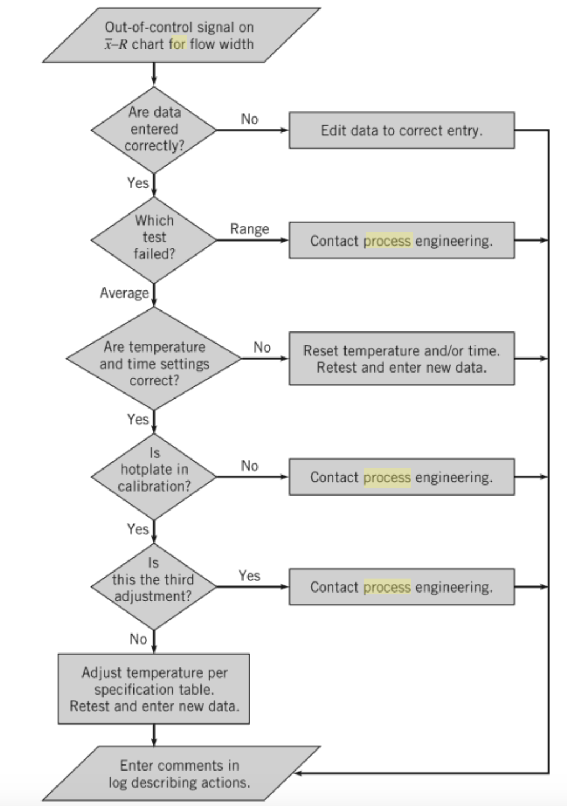

```{r setup, include=FALSE}
knitr::opts_chunk$set(echo = TRUE)
```
# Introduction

## Descricriptive statistics
Descriptive statistics is distinguished from inferential statistics (or inductive statistics) by its aim to summarize a sample, rather than use the data to learn about the population that the sample of data is thought to represent. Descriptive statistics is solely concerned with properties of the observed data, and it does not rest on the assumption that the data come from a larger population.

Some measures that are commonly used to describe a data set are measures of central tendency and measures of variability or dispersion. Measures of central tendency include the mean, median and mode, while measures of variability include the standard deviation (or variance), the minimum and maximum values of the variables, kurtosis and skewness.

## Inferential statistics

Inferential statistics uses the data from a sample to make inference about the larger population from which the sample was drawn. Because the goal of inferential statistics is to draw conclusions from a sample and generalize them to the population, we need to have confidence that our sample accurately reflects the population. 

## Properties of statistical tests

### Exactness
Using an exact test provides a significance test that keeps the Type I error rate of the test ($\alpha$) at the desired significance level of the test.


# Non-parametric methods

Non-parametric methods allow inference without making the assumption that the sample has been taken from a particular distribution. Therefore, they can applied in a vastely range of samples, for example when the assumptions of common parametric methods do not hold.

Parametric tests act exclusively within the population model, which is based on a hypothetical population with a specific distribution and of usually infinite size from which the samples are randomly drawn.

## Permutation test and permutation testing

The permutation test, introduced by R. A. Fisher in the 1930s, is used to check the hypothesis that the two groups being compared have identical distributions. The idea of the test is to build the distribution of the test statistic under the null hypothesis by calculating all possible values of the test statistic under rearrangements of the group labels on the observed data points. Even under normality but unequal variances, the method fails to control the probability of a Type I error when testing the hypothesis of equal means (e.g., Boik, 1987).

Permutation testing is also an abstract statistical procedure for hypothesis testing in which one calculates the values that the test statistic T assumes on the observed data and all permutations of the data to decide whether to accept or reject the null hypothesis. In other words, permutation testing can be used to obtain the distribution of the test statistic under the null hypothesis  by calculating all possible values of the test statistic under all possible rearrangements of the observed data points.

### Characteristics of permutation tests
The main characteristic of permutation tests lies in their adaptability to many different applications. These tests may be applied to continuous, ordered or categorical, normally or non-normally distributed data, to homogeneous or heterogeneous data, in both univariate and multivariate fields, to single or to repeated measurements. There exist problems that can be treated only within a permutation framework.

Another quality of permutation tests is their robustness. A parametric test is exact only if the underlying distribution is that on which the test is based. In this case, the test is often the best available test. If the underlying distribution is different, the parametric test loses these properties and its performance may be poor. On the contrary, provided that the observations are exchangeable under the null hypothesis, a permutation test is always exact and unbiased against shifts in the direction of higher values.

### Application to non-random samples

Parametric tests act exclusively within the population model, which is based on a hypothetical population with a specific distribution and of usually infinite size from which the samples are randomly drawn.

Permutation tests make full sense also when applied to groups obtained by randomization of a non random sample of subjects to the treatments. Under the null hypothesis of ineffective treatment the observations are exchangeable

### Abstract procedure

1. Compute the oberved test statistic $T(X) = S(X_a) - S (X_b)$ where $S$ is a symmetric (i.e. invariant with respect to the order of sample elements) and monotonic function such that large values of $T$ are evidence against $H_0$. Typical choices of $T$ includes:
  * $T(X) = \sum_{i=1}^{n_1} X_{i} - \sum_{i=n_1 + 1}^{n} X_{i}$ ( equivalent to  $T_a = \frac{1}{n}\sum_{i=1}^{n_1} X_{i} - \frac{1}{n - n_1}\sum_{i=n_1 + 1}^{n} X_{i}$)
  * $T_c(X) = \sum_{i=1}^{n_1} R(X_{i}) - \sum_{i=n_1 + 1}^{n} R(X_{i})$, where R is the rank function.
2. Build the null reference distribution by computing the test statistic in 1 with all permutations of group label assignments. Alternatively, the null reference distribution can be estimated by taking only $k$ random permutations.
3. Compute the p-value or the estimated p-value using $H_A$. For example, if the problem we are considering is 
  * 
  
Computational burden: the number of permuations is ${n_1  + n_2 \choose n_1} = \frac{(n_1 + n_2)!}{n_1!n_!}$.

Properties of p-value estimator: when $k$ is large, the p-value estimator is approximately normally distributed with mean $p$ and variance $p(1-p)/k$.

### Assumptions
* Exchangeability (under the null)

### Applicability 
The permutation test can be many applied to [Problem 0] and [Two-sample location problem].

### Examples
<!-- Let $X_1$ be a random variable representing one population and $X_2$ the random variable representing another population. We can then formally define the following test: -->
<!-- $H_O: X_1=_dX_2 \;\;\;\; H_A: X_1>_dX_2$ -->
<!-- Here $=_d$ denotes $F_1(x)=F_2(x) \;\; \forall x \in  R_{X_1,X_2}$ and means "is equal in distribution to", and $>_d$ denotes $F_1(x)\leq F_2(x) \;\; \forall x \in  R_{X_1,X_2}$ (first-order stochastic dominance). -->

### R algorithms

```{r, echo = TRUE}
T.test=function(x1,x2,alt,K=1000)
     {x=c(x1,x2)
      n1=length(x1)
      n2=length(x2)
      n=n1+n2
      t.ob=sum(x1)-sum(x2)
      t.perm=vector(,K)

      for (k in 1:K)
         {x.perm=sample(x)
          x1.perm=x.perm[1:n1]
          x2.perm=x.perm[(n1+1):(n1+n2)]
          t.perm[k]=sum(x1.perm)-sum(x2.perm)
         }
    
      if (alt=="greater")   pv.t=length(t.perm[t.perm>=t.ob])/K
      if (alt=="less")      pv.t=length(t.perm[t.perm<=t.ob])/K
      if (alt=="two.sided") pv.t=length(abs(t.perm)[abs(t.perm)>=abs(t.ob)])/K

     print(pv.t)
}

x1=rnorm(3)
x2=rnorm(3)
T.test(x1,x2,"two.sided",10000)

permutation.test=function(x1,x2,testStatistic,alt) {
  library(combinat)
  
  x=c(x1,x2)
  n1=length(x1)
  n2=length(x2)
  n=n1+n2
  t.ob=sum(x1)-sum(x2)
  x1.perm.indexes.array = combn(seq(1,n), n1)
  nperm = ncol(x1.perm.indexes.array)
  t.perm=vector(,nperm)
  
  for (i in 1:nperm) {
    x1.perm.indexes = x1.perm.indexes.array[,i]
    x2.perm.indexes = setdiff(seq(1,n), x1.perm.indexes)
    x1.perm = x[x1.perm.indexes]
    x2.perm = x[x2.perm.indexes]
    t.perm[i]=testStatistic(x1.perm,x2.perm)
  }
  
  if (alt=="greater")   pv.t=length(t.perm[t.perm>=t.ob])/nperm
  if (alt=="less")      pv.t=length(t.perm[t.perm<=t.ob])/nperm
  if (alt=="two.sided") pv.t=length(abs(t.perm)[abs(t.perm)>=abs(t.ob)])/nperm
  
  return(pv.t)
}

statistics.differenceOfSums = function(x1,x2){
  return(sum(x1)-sum(x2))
}

x1=rnorm(10)
x2=rnorm(10, mean = 1)
print(permutation.test(x1,x2,statistics.differenceOfSums,"two.sided"))

```

## Two-sample location problem
Let be $X_1 = (X_{11},...,X_{1n_1})$ and $X_2 = (X_{21},...,X_{2n_2})$ independent random samples taken from populations with continuous distribution functions that may differ only in their locations $\mu_1$
and $\mu_2$; let $n_1+n_2=n$.

The problem consists in testing:

$H_O: \mu_1 - \mu_2 = 0$ against $H_A: \mu_1 - \mu_2 \neq  0$

### The bi-aspect and tri-aspect tests
The permutation test for the [Two-sample location problem] take into consideration only the quantitative aspect $X_i$ of sample units and thus may be seen as uni-aspect tests. The $T_{ab}$ test is a nonparametric test for the same problem which considers also the categorical aspect $Z_i = I(X_i>M)$, where $M$ denotes the sample median. The two aspects are addressed respectively by:
* The $T_a$ test: $T_a = \sum_{i=1}^{n_1} X_{i} - \sum_{i=n_1 + 1}^{n} X_{i}$
* The $T_b$ test: $T_b = \sum_{i=1}^{n_1} Z_{i} - \sum_{i=n_1 + 1}^{n} Z_{i}$

The $T_a$ test
* is generally effective with regular, roughly symmetric,
unimodal, and light-tailed distributions, whereas it is not effective with highly asymmetric and/or heavy-tailed
distributions
* is not consistent for distributions for which the first and second moments do not exist

The $T_b$ test
* is much more powerful for detecting location shifts under highly-asymmetric and/or heavy-tailed distributions.
* is consistent for every distribution

The T_{abc} test extends the T_{ab} test by including a third aspect in the combination, the rank aspect $W_i = \sum_{j=1}^{n}{I(X_i \geq X_j)}$. This third aspect is adressed by the $T_c$ test $T_c = \sum_{i=1}^{n_1} W_{i} - \sum_{i=n_1 + 1}^{n} W_{i}$. Although $T_b$ is better than $T_c$ for some distributions like the double-exponential and the Cauchy, $T_c$ is better than $T_b$ with most distributions including the normal.

### Wilcoxon rank-sum test

The Wilcoxon rank-sum test is just a permutation test on ranks R(X_{i}) rather than on X_{i}.

## Two-sample location scale problem

Let be $X_1 = (X_{11},...,X_{1n_1})$ and $X_2 = (X_{21},...,X_{2n_2})$ independent random samples taken from populations with continuous distribution functions that may differ only in their locations $\mu_1$
and $\mu_2$ and variances $\sigma_1$and $\sigma_2$.

The problem consists in testing:

$H_O: \{\mu_1 = \mu_2 \cap \sigma_1 = \sigma_2\}$ against $H_A: \{\mu_1 \neq \mu_2 \cap \sigma_1 \neq \sigma_2\}$

### Lepage test
Lepage test is a nonparametric test for the  [Two-sample location scale problem] which is based on the combination of two tests, one for location and another for scale. The combination is achieved through the sum of the squared standardized Wilcoxon-Mann-Whitney and Ansari-Bradley statistics:

### Cucconi test

Cucconi test is a nonparametric test for the  [Two-sample location scale problem] which is not  familiar as other location-scale tests but it is of interest for several reasons:

* From a historical point of view, it is of interest because it has been
proposed some years before the Lepage test.
* It is not a combination of a test for location and a test for scale as
the other location-scale tests.
* It compares favorably with Lepage type tests in terms of power
and type one error probability.
* It is much more easy to be computed because it requires only the ranks of one sample in the combined sample, whereas many other tests require also scores of various types as well as to permutationally estimate mean and variance of test statistics because their analytic formulae are not available.


# Statistical process control

Statistical process control (SPC) is a set of tools useful in achieving process stability and improving capability through the reduction of variability.

## Introduction

### In control and out of control processes

```{definition, name="In control process"}
A process that is operating with only chance causes of variation.
```

Besides variability due to randomness (also called background noise), other kinds of variability may occasionally be present in the output of a process. This variability usually arises from three sources: 
  
*  improperly adjusted or controlled machines
*  operator errors
*  defective raw material

```{definition, name="Assignable cause of variation"}
A cause of process variability that is not part of the chance cause pattern.
```

Variability with an assignable cause is generally large when compared to the background noise, and it usually represents an unacceptable level of process performance.

```{definition, name="Out of control process"}
A process that is operating in the presence of assignable causes of variation.
```

A major objective of statistical process control is to quickly detect the occurrence of assignable causes of process shifts so that investigation of the process and corrective action may be undertaken before many nonconforming units are manufactured.

## Control charts

The most important use of a control chart is **on-line process surveillance to improve the process**. 

Furthermore, control charts have had a long history of use in U.S. industries. There are at least five reasons for their popularity:

*  **Control charts are a proven technique for improving productivity.** A successful control chart program will reduce scrap and rework, which are the primary productivity killers in any operation. If you reduce scrap and rework, then productivity increases, cost decreases, and production capacity (measured in the number of good parts per hour) increases.
*  **Control charts are effective in defect prevention.** The control chart helps keep the process in control, which is consistent with the “do it right the first time” philosophy. It is never cheaper to sort out “good” units from “bad” units later on than it is to build it right initially. 
*  **Control charts prevent unnecessary process adjustment.** If process operators adjust the process based on periodic tests unrelated to a control chart program, they will often overreact to the background noise and make unneeded adjustments. In other words, the control chart is consistent with the “if it isn’t broken, don’t fix it” philosophy.
*  **Control charts provide diagnostic information.** Frequently, the pattern of points on the control chart will contain information of diagnostic value to an experienced operator or engineer. This information allows the implementation of a change in the process that improves its performance.
*  **Control charts provide information about process capability.** Control charts are among the most important management control tools; they are as important as cost controls and material controls. 

## Control charts components
A typical control chart (Shewhart control chart) is shown in Fig. 2. The control chart displays the quality characteristic that has been measured or computed from a sample versus the sample number or time. The chart contains a center line that represents the average value of the quality characteristic corresponding to the in-control state. Two other horizontal lines, called the upper control limit (UCL) and the lower control limit (LCL), are also shown on the chart. These control limits are chosen so that if the process is in control, nearly all of the sample points will fall between them.

## Out of control indicators
As long as the points plot within the control limits, the process is assumed to be in control, and no action is necessary. However, **a point that plots outside of the control limits** is interpreted as evidence that the process is out of control, and investigation and corrective action are required to find and eliminate the assignable cause or causes responsible for this behavior. 

Even if all the points plot inside the control limits, if they behave in a systematic or nonrandom manner, then this could be an indication that the process is out of control. Methods for looking for sequences or **nonrandom patterns** can be applied to control charts as an aid in detecting out-of-control conditions.

### Out of Control Action Plan (OCAP)
A very important part of the corrective action process associated with control chart usage is the out-of-control-action plan (OCAP). An OCAP is a flow chart or text-based description of the sequence of activities that must take place following the occurrence of an activating event. These are usually out-of-control signals from the control chart. 


## Types of control charts 
Control charts may be classified into two general types. 

If the quality characteristic can be measured and expressed as a number on some continuous scale of measurement, it is usually called a variable. Control charts for central tendency and variability of variables are collectively called **variables control charts**. 

Many quality characteristics are not measured on a continuous scale or even a quantitative scale. In these cases:

* we may judge each unit of product as either conforming or nonconforming on the basis of whether or not it possesses certain attributes, or
* we may count the number of nonconformities (defects) appearing on a unit of product.

Control charts for such quality characteristics are called **attributes control charts**. 

## Control chart design
To design a control chart it is necessary to select:

* sample size,
* control limits (UCL and LCL)
* frequency of sampling

### Shewhart control chart

Let $w$ be a sample statistic that measures some quality characteristic of interest, and suppose that
the mean of $w$ is $\mu_w$ and the standard deviation of $w$ is $\sigma_w$. Then, the Shewhart control chart center line,  upper control limit, and lower control limit are:

* $UCL = \mu_w + L \sigma_w$
* $LCL = \mu_w - L \sigma_w$

where L is the distance of the control limits from the center line, expressed in standard deviation units. Very coommonly $L$ is set to 3 (three-sigma rule). 

### Connection with hyphothesis testing and confidence intervals.

In Shewhart control chart, the interval given by $\mu_w \pm L \sigma_w$ is a $100(2*\phi(1-L))\%$ confidence interval for each sample average.


